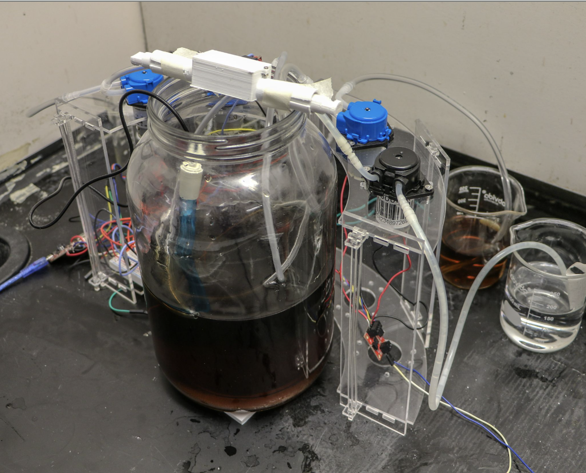

# John Worklog

# 2021-02-13 - Discussion with Workshop
Reviewed the previous kombucha fermentation prototype and drafted a new layout to improve tube organization inside the jar. Considering mounting the ultrasonic sensor by cutting holes in the lid rather than 3D-printing a sensor housing. Plan to reuse the acrylic stand, but with fewer pump holes.

# 2021-02-20 - US Sensor testing
Wrote code for a GPIO-efficient ultrasonic sensor interface for 3 different US sensors: one for the main jar, one for new tea, and one for the waste/completed fermented tea. To save IO pins (and board space) for other components like the temperature sensor, motor driver, and relay, all three sensors share the same trigger pin while using separate echo pins. The sensors are read sequentially (not simultaneously), which is acceptable for this application since level measurements do not need high-speed updates. Reading them one at a time also helps reduce ultrasonic crosstalk/interference between sensors.

# 2021-02-24 - Temperature Sensor testing
Wrote code to interface the DS18B20 temperature sensor for reading system temperature values (in both °C and °F) for the fermentation control system. Set up the sensor using the OneWire and DallasTemperature libraries, where OneWire handles communication on the data line and DallasTemperature provides higher-level functions for requesting and reading temperature values. Created a reusable .h / .cpp class wrapper so the main code can easily initialize the sensor, request/read temperatures, and return values for control comparisons (e.g., heater on/off thresholds). Also added a validity check to reject disconnected/invalid readings (e.g., -127°C) so bad sensor data does not affect control decisions. Observed that temperature changes gradually (as expected) and that readings are more stable/representative when the sensor is fully submerged.
