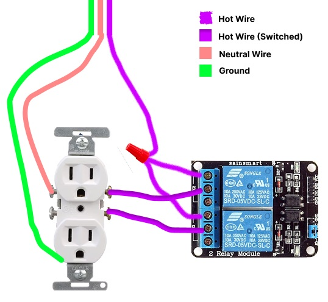
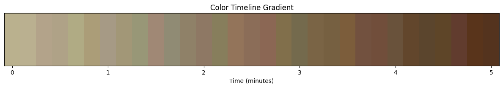

# John Worklog

# 2021-02-13 - Discussion with Workshop
Reviewed the previous kombucha fermentation prototype and drafted a new layout to improve tube organization inside the jar. Considering mounting the ultrasonic sensor by cutting holes in the lid rather than 3D-printing a sensor housing. Plan to reuse the acrylic stand, but with fewer pump holes.

---

# 2021-02-20 - US Sensor testing
Wrote code for a GPIO-efficient ultrasonic sensor interface for 3 different US sensors: one for the main jar, one for new tea, and one for the waste/completed fermented tea. To save IO pins (and board space) for other components like the temperature sensor, motor driver, and relay, all three sensors share the same trigger pin while using separate echo pins. The sensors are read sequentially (not simultaneously), which is acceptable for this application since level measurements do not need high-speed updates. Reading them one at a time also helps reduce ultrasonic crosstalk/interference between sensors.

---

# 2021-02-24 - Temperature Sensor testing
Wrote code to interface the DS18B20 temperature sensor for reading system temperature values (in both °C and °F) for the fermentation control system. Set up the sensor using the OneWire and DallasTemperature libraries, where OneWire handles communication on the data line and DallasTemperature provides higher-level functions for requesting and reading temperature values. Created a reusable .h / .cpp class wrapper so the main code can easily initialize the sensor, request/read temperatures, and return values for control comparisons (e.g., heater on/off thresholds). Also added a validity check to reject disconnected/invalid readings (e.g., -127°C) so bad sensor data does not affect control decisions. Observed that temperature changes gradually (as expected) and that readings are more stable/representative when the sensor is fully submerged.

---

## 2026-03-01 - AC Peripheral Control Plan

Discussed how to safely control the original wall-powered peripherals. One possible plan was to build a small outlet box with a relay inside it so the ESP32 could switch AC-powered devices while keeping the high-voltage wiring contained. This seemed like a good solution because it would allow existing plug-in heating or aeration peripherals to be controlled without modifying the devices directly.

After looking more closely at safety and wiring complexity, this approach seemed risky for a wet fermentation setup. The idea was useful, but it added more AC wiring near liquids than we wanted.

---

## 2026-03-06 - Switch from AC Peripherals to 12 V DC Actuators

Updated the actuation plan to avoid using multiple wall-powered AC peripherals. The new approach uses 12 V DC peripherals where possible, including the pumps and heating hardware. This made the design simpler because the same 12 V supply can power the actuation hardware, while a buck converter provides 5 V for the ESP32 and sensor modules.

This change also improved safety because the project enclosure no longer needs to switch AC power internally. Keeping the system mostly low-voltage DC is better for a wet fermentation environment.

---

## 2026-03-10 - pH Sensor Calibration Setup

Integrated the analog pH sensing board with the ESP32 ADC input. Set up firmware to read the pH output voltage and convert it into a pH value using a two-point calibration method. Added calibration constants so the slope and offset can be adjusted without rewriting the full sensor pipeline.

The pH conversion was modeled as a linear two-point calibration:

**pH = mVpH + b**

where **VpH** is the measured analog voltage from the pH board, **m** is the calibration slope, and **b** is the calibration offset.

Using two known buffer solutions, the slope and offset are calculated as:

**m = (pH2 - pH1) / (V2 - V1)**

**b = pH1 - mV1**

After calibration, each measured pH-board voltage can be converted into an estimated pH value using the linear equation above.

Also checked the pH signal conditioning because the ESP32 ADC input must stay within the 0–3.3 V range. The pH sensor worked for detecting larger acidity trends, but calibration drift became a concern during longer testing.

---

## 2026-03-14 - RGB Sensor and HSL Conversion

Integrated the TCS34725 RGB color sensor over I²C. Wrote firmware to collect raw red, green, blue, and clear-channel values, then convert the RGB readings into HSL values. HSL was added because it is easier to track color-state changes over time than using raw RGB values alone.

Tested the sensor with different liquid samples. Darker or more opaque samples gave clearer color separation, while translucent broth was harder to classify consistently. This showed that the RGB sensor could detect broad visual changes, but calibration and sensor placement would be important.

---

## 2026-03-18 - Ultrasonic Filtering Update

Updated the ultrasonic firmware to improve level measurement stability. Instead of using a single distance reading, the firmware now collects five readings and uses the median value. This helps reject occasional noisy readings caused by surface motion, sensor angle, or inconsistent echoes.

This filtering step made the level readings more stable before they were passed into the control logic and dashboard.

**Image to add:** ultrasonic graph showing smoother distance readings  
``

---

## 2026-03-23 - Mechanical Design Update

Updated the physical layout to better separate wet fermentation components from electronics. The main jar, fresh-tea reservoir, and waste reservoir were arranged with tubing routed between them. The electronics were moved to a separate container placed to the side of the fermentation setup instead of directly under the wet area.

The acrylic stand was reused to support pumps and organize the physical setup. Sensor placement was also adjusted: the pH and temperature probes directly contact the liquid, the RGB sensor sits below the jar, and ultrasonic sensors sit above each container.

**Image to add:** updated mechanical layout with jar, pumps, tubing, and electronics container  
``

---

## 2026-03-29 - Local ESP32 Webpage Issue

Tested the idea of hosting the dashboard directly on the ESP32. This worked locally in some cases, but it was not reliable for the final setup because network/firewall issues blocked access in some environments. This made it difficult to depend on the ESP32-hosted page for monitoring, especially if the user wanted to view data from another device or network.

Started looking for a replacement approach using an MQTT broker and external dashboard so the ESP32 only needs to publish data instead of hosting the whole interface.

**Image to add:** screenshot of local ESP32 webpage attempt or connection issue  
``

---

## 2026-04-03 - MQTT Telemetry Pipeline

Started moving the system from a local ESP32-hosted webpage to an MQTT-based telemetry pipeline. Set up the ESP32 to publish telemetry messages over Wi-Fi, including temperature, pH, ultrasonic level readings, RGB/HSL color values, actuator states, and alert flags.

Organized MQTT topics for telemetry, status, alerts, command acknowledgments, and dashboard commands. This made the system more flexible because the ESP32 could focus on sensing/control while the dashboard and data storage were handled externally.

**Image to add:** MQTT topic diagram or EMQX dashboard screenshot  
``

---

## 2026-04-08 - Python Ingest Script and Database Logging

Worked on the Python ingest script that subscribes to the EMQX MQTT broker and processes incoming ESP32 messages. The script parses telemetry, status, alert, and command acknowledgment payloads. It then stores sensor and event data in the SQL database so the dashboard can show both live readings and historical trends.

This was important because fermentation happens over multiple days, so the system needs stored data rather than only live values.

**Image to add:** ingest script running in terminal or SQL/Supabase telemetry table  
``

---

## 2026-04-11 - Discord Alerts

Added Discord alert forwarding through the Python ingest pipeline. Important alert messages from the ESP32 can now be sent to Discord so the user is notified when an abnormal condition occurs, such as a sensor fault, waste overflow, or unsafe actuator state.

This helps make the system more useful when the user is not actively watching the dashboard.

**Image to add:** Discord alert screenshot  
``

---

## 2026-04-13 - Dashboard Updates

Updated the dashboard to show live sensor values, actuator states, system configuration, manual controls, command responses, and active alerts. Added history graphs for temperature, pH, liquid level, and color-state changes so the user can review how the system behaved over time.

Also started adding batch-tracking features so a new fermentation run can be separated from previous data. This still needs more testing because database batch assignment can become inconsistent if the frontend and ingest script are not synchronized.

**Image to add:** dashboard live page and history graph page  
``  
``

---

## 2026-04-17 - Full-System Integration Testing

Began full-system integration testing with sensors, actuators, MQTT telemetry, database logging, Discord alerts, and dashboard controls running together. Verified that the ESP32 could read sensors, publish telemetry, respond to manual commands, and update actuator states without resetting during normal operation.

Collected verification data for ultrasonic levels, temperature response, pH trends, and RGB/HSL color changes. Also documented remaining limitations, including pH calibration drift, RGB sensitivity to lighting and liquid opacity, heating pad contact issues, mechanical cleaning challenges, and occasional batch-organization issues in the database.

**Image to add:** final verification graphs  
``

**Image to add:** final prototype photo  
``
